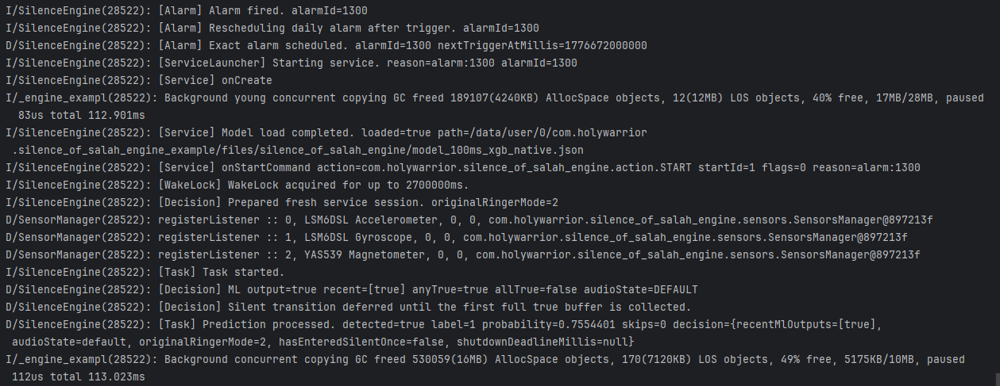

## alarm fired successfully

## Task Log formatted as markdown table

| detected | label | probability  | skips | recentMlOutputs | audioState | originalRingerMode | hasEnteredSilentOnce | shutdownDeadlineMillis |
| -------- | ----- | ------------ | ----- | --------------- | ---------- | ------------------ | -------------------- | ---------------------- |
| true     | 1     | 0.5661636    | 0     | [1, 0, 0, 0, 1] | silent     | 2                  | true                 | null                   |
| true     | 1     | 0.6606752    | 0     | [0, 0, 0, 1, 1] | silent     | 2                  | true                 | null                   |
| true     | 1     | 0.5063689    | 0     | [0, 0, 1, 1, 1] | silent     | 2                  | true                 | null                   |
| false    | 0     | 0.48940814   | 0     | [0, 1, 1, 1, 0] | silent     | 2                  | true                 | null                   |
| false    | 0     | 0.49916345   | 0     | [1, 1, 1, 0, 0] | silent     | 2                  | true                 | null                   |
| false    | 0     | 0.4381948    | 0     | [1, 1, 0, 0, 0] | silent     | 2                  | true                 | null                   |
| true     | 1     | 0.6924376    | 0     | [1, 0, 0, 0, 1] | silent     | 2                  | true                 | null                   |
| true     | 1     | 0.65103275   | 0     | [0, 0, 0, 1, 1] | silent     | 2                  | true                 | null                   |
| true     | 1     | 0.5731074    | 0     | [0, 0, 1, 1, 1] | silent     | 2                  | true                 | null                   |
| true     | 1     | 0.6717875    | 0     | [0, 1, 1, 1, 1] | silent     | 2                  | true                 | null                   |
| false    | 0     | 0.4776032    | 0     | [1, 1, 1, 1, 0] | silent     | 2                  | true                 | null                   |
| false    | 0     | 0.4955522    | 0     | [1, 1, 1, 0, 0] | silent     | 2                  | true                 | null                   |
| true     | 1     | 0.5138903    | 0     | [1, 1, 0, 0, 1] | silent     | 2                  | true                 | null                   |
| false    | 0     | 0.45137808   | 0     | [1, 0, 0, 1, 0] | silent     | 2                  | true                 | null                   |
| false    | 0     | 0.4914776    | 0     | [0, 0, 1, 0, 0] | silent     | 2                  | true                 | null                   |
| false    | 0     | 0.49589747   | 0     | [0, 1, 0, 0, 0] | silent     | 2                  | true                 | null                   |
| true     | 1     | 0.703192     | 0     | [1, 0, 0, 0, 1] | silent     | 2                  | true                 | null                   |
| true     | 1     | 0.5537743    | 0     | [0, 0, 0, 1, 1] | silent     | 2                  | true                 | null                   |
| false    | 0     | 0.47980815   | 0     | [0, 0, 1, 1, 0] | silent     | 2                  | true                 | null                   |
| true     | 1     | 0.5432496    | 0     | [0, 1, 1, 0, 1] | silent     | 2                  | true                 | null                   |
| true     | 1     | 0.6763333    | 0     | [1, 1, 0, 1, 1] | silent     | 2                  | true                 | null                   |
| true     | 1     | 0.54025537   | 0     | [1, 0, 1, 1, 1] | silent     | 2                  | true                 | null                   |
| true     | 1     | 0.50109375   | 0     | [0, 1, 1, 1, 1] | silent     | 2                  | true                 | null                   |
| false    | 0     | 0.38269725   | 0     | [1, 1, 1, 1, 0] | silent     | 2                  | true                 | null                   |
| false    | 0     | 0.44814876   | 0     | [1, 1, 1, 0, 0] | silent     | 2                  | true                 | null                   |
| false    | 0     | 0.44416484   | 0     | [1, 1, 0, 0, 0] | silent     | 2                  | true                 | null                   |
| false    | 0     | 0.37757456   | 0     | [1, 0, 0, 0, 0] | silent     | 2                  | true                 | null                   |
| false    | 0     | 0.45120212   | 0     | [0, 0, 0, 0, 0] | default    | 2                  | true                 | 1776582401340          |
| false    | 0     | 0.40800503   | 0     | [0, 0, 0, 0, 0] | default    | 2                  | true                 | 1776582401340          |
| false    | 0     | 0.39741912   | 0     | [0, 0, 0, 0, 0] | default    | 2                  | true                 | 1776582401340          |
| true     | 1     | 0.56191385   | 0     | [0, 0, 0, 0, 1] | silent     | 2                  | true                 | null                   |
| false    | 0     | 0.4305709    | 0     | [0, 0, 0, 1, 0] | silent     | 2                  | true                 | null                   |
| false    | 0     | 0.43665716   | 0     | [0, 0, 1, 0, 0] | silent     | 2                  | true                 | null                   |
| false    | 0     | 0.34269634   | 0     | [0, 1, 0, 0, 0] | silent     | 2                  | true                 | null                   |
| false    | 0     | 0.46272993   | 0     | [1, 0, 0, 0, 0] | silent     | 2                  | true                 | null                   |
| true     | 1     | 0.8267279    | 0     | [0, 0, 0, 0, 1] | silent     | 2                  | true                 | null                   |
| true     | 1     | 0.6535711    | 0     | [0, 0, 0, 1, 1] | silent     | 2                  | true                 | null                   |
| true     | 1     | 0.6891312    | 0     | [0, 0, 1, 1, 1] | silent     | 2                  | true                 | null                   |
| true     | 1     | 0.8955286    | 0     | [0, 1, 1, 1, 1] | silent     | 2                  | true                 | null                   |
| true     | 1     | 0.77538      | 0     | [1, 1, 1, 1, 1] | silent     | 2                  | true                 | null                   |
| true     | 1     | 0.72198623   | 0     | [1, 1, 1, 1, 1] | silent     | 2                  | true                 | null                   |
| true     | 1     | 0.72808504   | 0     | [1, 1, 1, 1, 1] | silent     | 2                  | true                 | null                   |
| true     | 1     | 0.7933191    | 0     | [1, 1, 1, 1, 1] | silent     | 2                  | true                 | null                   |
| true     | 1     | 0.64311314   | 0     | [1, 1, 1, 1, 1] | silent     | 2                  | true                 | null                   |
| false    | 0     | 0.16942072   | 0     | [1, 1, 1, 1, 0] | silent     | 2                  | true                 | null                   |
| false    | 0     | 0.041381825  | 0     | [1, 1, 1, 0, 0] | silent     | 2                  | true                 | null                   |
| false    | 0     | 0.001096094  | 0     | [1, 1, 0, 0, 0] | silent     | 2                  | true                 | null                   |
| false    | 0     | 9.498074E-4  | 0     | [1, 0, 0, 0, 0] | silent     | 2                  | true                 | null                   |
| false    | 0     | 0.0011580191 | 0     | [0, 0, 0, 0, 0] | default    | 2                  | true                 | 1776582565116          |
| false    | 0     | 0.0011073037 | 0     | [0, 0, 0, 0, 0] | default    | 2                  | true                 | 1776582565116          |
| false    | 0     | 0.0010043207 | 0     | [0, 0, 0, 0, 0] | default    | 2                  | true                 | 1776582565116          |
| false    | 0     | 0.0010048801 | 0     | [0, 0, 0, 0, 0] | default    | 2                  | true                 | 1776582565116          |
| false    | 0     | 0.001096094  | 0     | [0, 0, 0, 0, 0] | default    | 2                  | true                 | 1776582565116          |
| false    | 0     | 0.0011044209 | 0     | [0, 0, 0, 0, 0] | default    | 2                  | true                 | 1776582565116          |
| false    | 0     | 0.0010055687 | 0     | [0, 0, 0, 0, 0] | default    | 2                  | true                 | 1776582565116          |
| false    | 0     | 0.0010498811 | 0     | [0, 0, 0, 0, 0] | default    | 2                  | true                 | 1776582565116          |
| false    | 0     | 0.001093795  | 0     | [0, 0, 0, 0, 0] | default    | 2                  | true                 | 1776582565116          |
| false    | 0     | 0.0012031862 | 0     | [0, 0, 0, 0, 0] | default    | 2                  | true                 | 1776582565116          |
| false    | 0     | 0.0010373193 | 0     | [0, 0, 0, 0, 0] | default    | 2                  | true                 | 1776582565116          |
| false    | 0     | 0.0010616215 | 0     | [0, 0, 0, 0, 0] | default    | 2                  | true                 | 1776582565116          |
| false    | 0     | 0.0011468891 | 0     | [0, 0, 0, 0, 0] | default    | 2                  | true                 | 1776582565116          |
| false    | 0     | 0.0012571741 | 0     | [0, 0, 0, 0, 0] | default    | 2                  | true                 | 1776582565116          |
| false    | 0     | 0.0011035774 | 0     | [0, 0, 0, 0, 0] | default    | 2                  | true                 | 1776582565116          |
| false    | 0     | 9.760611E-4  | 0     | [0, 0, 0, 0, 0] | default    | 2                  | true                 | 1776582565116          |
| false    | 0     | 9.4904576E-4 | 0     | [0, 0, 0, 0, 0] | default    | 2                  | true                 | 1776582565116          |
| false    | 0     | 9.3144074E-4 | 0     | [0, 0, 0, 0, 0] | default    | 2                  | true                 | 1776582565116          |
| false    | 0     | 0.0011921098 | 0     | [0, 0, 0, 0, 0] | default    | 2                  | true                 | 1776582565116          |
| false    | 0     | 0.0010625129 | 0     | [0, 0, 0, 0, 0] | default    | 2                  | true                 | 1776582565116          |
| false    | 0     | 0.0010477279 | 0     | [0, 0, 0, 0, 0] | default    | 2                  | true                 | 1776582565116          |
| false    | 0     | 0.0010215631 | 0     | [0, 0, 0, 0, 0] | default    | 2                  | true                 | 1776582565116          |
| false    | 0     | 0.0010546373 | 0     | [0, 0, 0, 0, 0] | default    | 2                  | true                 | 1776582565116          |
| false    | 0     | 0.0010875796 | 0     | [0, 0, 0, 0, 0] | default    | 2                  | true                 | 1776582565116          |
| false    | 0     | 0.0011061066 | 0     | [0, 0, 0, 0, 0] | default    | 2                  | true                 | 1776582565116          |
| false    | 0     | 0.0010777315 | 0     | [0, 0, 0, 0, 0] | default    | 2                  | true                 | 1776582565116          |
| false    | 0     | 0.0011341842 | 0     | [0, 0, 0, 0, 0] | default    | 2                  | true                 | 1776582565116          |
| false    | 0     | 0.0010381972 | 0     | [0, 0, 0, 0, 0] | default    | 2                  | true                 | 1776582565116          |
| false    | 0     | 0.0012413391 | 0     | [0, 0, 0, 0, 0] | default    | 2                  | true                 | 1776582565116          |
| false    | 0     | 0.0011372425 | 0     | [0, 0, 0, 0, 0] | default    | 2                  | true                 | 1776582565116          |
| false    | 0     | 0.0010390126 | 0     | [0, 0, 0, 0, 0] | default    | 2                  | true                 | 1776582565116          |
| false    | 0     | 0.0011288922 | 0     | [0, 0, 0, 0, 0] | default    | 2                  | true                 | 1776582565116          |
| false    | 0     | 0.0010466236 | 0     | [0, 0, 0, 0, 0] | default    | 2                  | true                 | 1776582565116          |
| false    | 0     | 0.0010287317 | 0     | [0, 0, 0, 0, 0] | default    | 2                  | true                 | 1776582565116          |
| false    | 0     | 0.0013076856 | 0     | [0, 0, 0, 0, 0] | default    | 2                  | true                 | 1776582565116          |
| false    | 0     | 0.001078284  | 0     | [0, 0, 0, 0, 0] | default    | 2                  | true                 | 1776582565116          |
| false    | 0     | 0.0011283198 | 0     | [0, 0, 0, 0, 0] | default    | 2                  | true                 | 1776582565116          |
| false    | 0     | 0.0011651369 | 0     | [0, 0, 0, 0, 0] | default    | 2                  | true                 | 1776582565116          |
| false    | 0     | 9.5027266E-4 | 0     | [0, 0, 0, 0, 0] | default    | 2                  | true                 | 1776582565116          |
| false    | 0     | 0.0011297286 | 0     | [0, 0, 0, 0, 0] | default    | 2                  | true                 | 1776582565116          |
| false    | 0     | 0.0011288922 | 0     | [0, 0, 0, 0, 0] | default    | 2                  | true                 | 1776582565116          |
| false    | 0     | 0.0010215631 | 0     | [0, 0, 0, 0, 0] | default    | 2                  | true                 | 1776582565116          |
| false    | 0     | 0.0011495464 | 0     | [0, 0, 0, 0, 0] | default    | 2                  | true                 | 1776582565116          |
| false    | 0     | 0.0011680145 | 0     | [0, 0, 0, 0, 0] | default    | 2                  | true                 | 1776582565116          |
| false    | 0     | 0.0010215631 | 0     | [0, 0, 0, 0, 0] | default    | 2                  | true                 | 1776582565116          |
| false    | 0     | 0.0010974199 | 0     | [0, 0, 0, 0, 0] | default    | 2                  | true                 | 1776582565116          |
| false    | 0     | 0.0011159334 | 0     | [0, 0, 0, 0, 0] | default    | 2                  | true                 | 1776582565116          |
| false    | 0     | 9.340544E-4  | 0     | [0, 0, 0, 0, 0] | default    | 2                  | true                 | 1776582565116          |
| false    | 0     | 0.0012512298 | 0     | [0, 0, 0, 0, 0] | default    | 2                  | true                 | 1776582565116          |
| false    | 0     | 0.0010466236 | 0     | [0, 0, 0, 0, 0] | default    | 2                  | true                 | 1776582565116          |
| false    | 0     | 0.0012916666 | 0     | [0, 0, 0, 0, 0] | default    | 2                  | true                 | 1776582565116          |
| false    | 0     | 9.5773E-4    | 0     | [0, 0, 0, 0, 0] | default    | 2                  | true                 | 1776582565116          |
| false    | 0     | 0.0012059187 | 0     | [0, 0, 0, 0, 0] | default    | 2                  | true                 | 1776582565116          |
| false    | 0     | 9.661783E-4  | 0     | [0, 0, 0, 0, 0] | default    | 2                  | true                 | 1776582565116          |
| false    | 0     | 0.0011288922 | 0     | [0, 0, 0, 0, 0] | default    | 2                  | true                 | 1776582565116          |
| false    | 0     | 0.0011354532 | 0     | [0, 0, 0, 0, 0] | default    | 2                  | true                 | 1776582565116          |
| false    | 0     | 0.0010696857 | 0     | [0, 0, 0, 0, 0] | default    | 2                  | true                 | 1776582565116          |
| false    | 0     | 0.0010032563 | 0     | [0, 0, 0, 0, 0] | default    | 2                  | true                 | 1776582565116          |
| false    | 0     | 0.0010218414 | 0     | [0, 0, 0, 0, 0] | default    | 2                  | true                 | 1776582565116          |
| false    | 0     | 0.0011449101 | 0     | [0, 0, 0, 0, 0] | default    | 2                  | true                 | 1776582565116          |
| false    | 0     | 0.0011872568 | 0     | [0, 0, 0, 0, 0] | default    | 2                  | true                 | 1776582565116          |
| false    | 0     | 9.668257E-4  | 0     | [0, 0, 0, 0, 0] | default    | 2                  | true                 | 1776582565116          |
| false    | 0     | 0.0011083379 | 0     | [0, 0, 0, 0, 0] | default    | 2                  | true                 | 1776582565116          |
| false    | 0     | 0.0010466236 | 0     | [0, 0, 0, 0, 0] | default    | 2                  | true                 | 1776582565116          |
| false    | 0     | 0.0010578175 | 0     | [0, 0, 0, 0, 0] | default    | 2                  | true                 | 1776582565116          |
| false    | 0     | 0.0010508623 | 0     | [0, 0, 0, 0, 0] | default    | 2                  | true                 | 1776582565116          |
| false    | 0     | 0.0011751966 | 0     | [0, 0, 0, 0, 0] | default    | 2                  | true                 | 1776582565116          |
| false    | 0     | 0.0012055902 | 0     | [0, 0, 0, 0, 0] | default    | 2                  | true                 | 1776582565116          |
| false    | 0     | 8.599447E-4  | 0     | [0, 0, 0, 0, 0] | default    | 2                  | true                 | 1776582565116          |
| false    | 0     | 0.0011698874 | 0     | [0, 0, 0, 0, 0] | default    | 2                  | true                 | 1776582565116          |